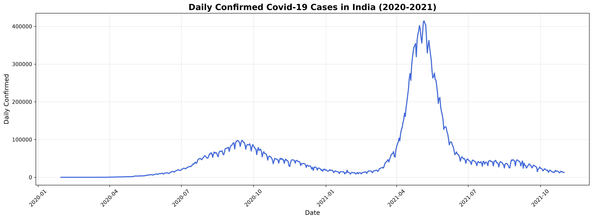
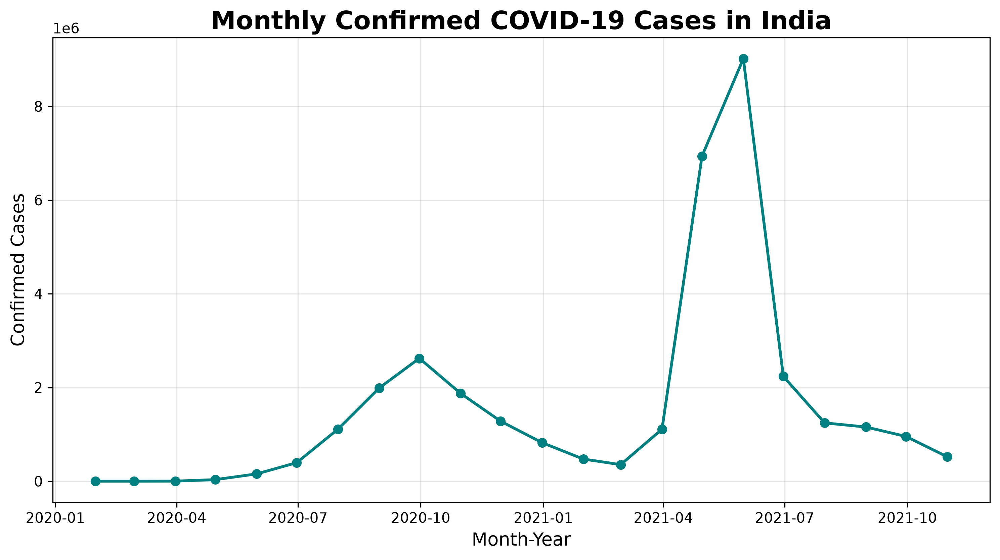
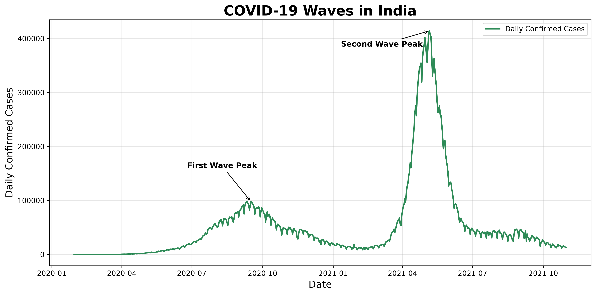
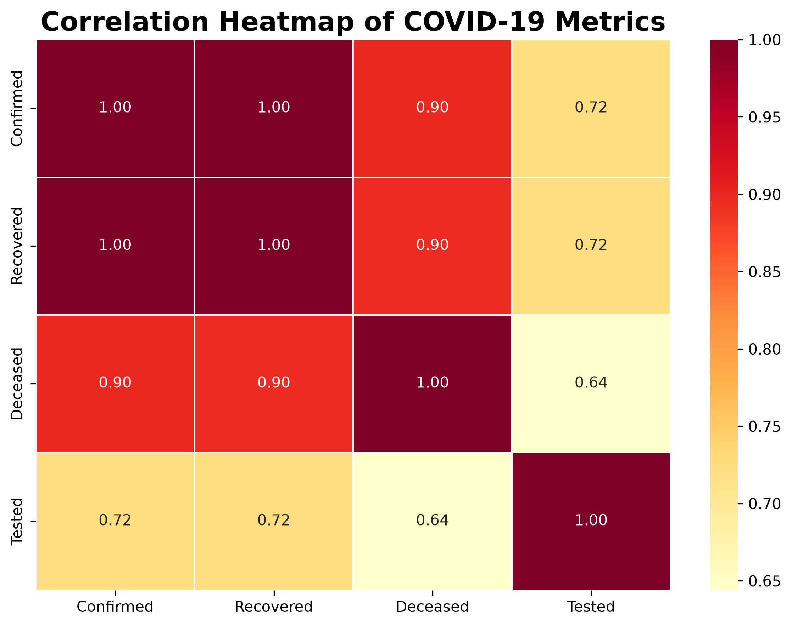

# 🦠 COVID-19 India Data Analysis (2020–2021)


---

# 📖 Project Overview

This project presents a comprehensive **Exploratory Data Analysis (EDA)** of the COVID-19 pandemic in India using Python. The analysis covers the period from **January 2020 to October 2021**, focusing on infection trends, recovery patterns, mortality, state-wise comparisons, correlation analysis, feature engineering, and time-series visualization.

The project demonstrates practical applications of **Pandas, NumPy, Matplotlib, and Seaborn** while transforming raw COVID-19 datasets into meaningful visual insights.

---

# 🎯 Objectives

- Analyze the spread of COVID-19 in India.
- Study daily and monthly case trends.
- Compare COVID-19 statistics across Indian states.
- Explore recovery and fatality rates.
- Identify pandemic waves.
- Perform feature engineering using derived metrics.
- Visualize relationships between multiple COVID-19 indicators.
- Build a portfolio-quality EDA project suitable for GitHub and interviews.

---

# 📂 Dataset

The analysis uses publicly available COVID-19 datasets containing:

- Daily confirmed cases
- Daily recovered cases
- Daily deceased cases
- State-wise cumulative statistics
- Testing data
- Date-wise time-series information

---

# 🛠️ Technologies Used

| Tool | Purpose |
|------|----------|
| Python | Programming Language |
| Pandas | Data Cleaning & Analysis |
| NumPy | Numerical Operations |
| Matplotlib | Data Visualization |
| Seaborn | Statistical Visualization |
| Jupyter Notebook | Interactive Analysis |

---

# 📁 Project Structure

```
COVID19-INDIA-ANALYSIS/
│
├── data/
│   ├── case_time_series.csv
│   ├── raw_data1.csv
│   ├── raw_data2.csv
│   └── ...
│
├── images/
│   ├── daily_confirmed_cases.png
│   ├── monthly_confirmed_cases.png
│   ├── correlation_heatmap.png
│   ├── covid_waves_india.png
│   ├── custom_risk_score.png
│   └── ...
│
├── covid_analysis.ipynb
├── README.md
├── requirements.txt
├── .gitignore
└── LICENSE
```

---

# 📊 Exploratory Data Analysis

## 📈 Chart 1: Daily Confirmed COVID-19 Cases
Visualizes the day-to-day trend of confirmed COVID-19 cases in India, helping identify infection surges and major outbreak periods.

---

## 📈 Chart 2: Daily Recovered COVID-19 Cases
Shows the daily recovery trend and illustrates how patient recoveries changed throughout the pandemic.

---

## 📈 Chart 3: Daily Deceased COVID-19 Cases
Displays the daily number of COVID-19 deaths, highlighting mortality trends over time.

---

## 📊 Chart 4: Top 10 States by Confirmed Cases
Compares the ten Indian states with the highest cumulative confirmed COVID-19 cases.

---

## 📊 Chart 5: Top 10 States by Recovered Cases
Ranks the top ten states based on the total number of recovered COVID-19 patients.

---

## 📊 Chart 6: Top 10 States by Death Cases
Illustrates the states that recorded the highest cumulative COVID-19 deaths.

---

## 📊 Chart 7: Top 10 States by COVID-19 Tests
Compares testing volumes across Indian states to understand testing efforts.

---

## 📈 Chart 8: Monthly Confirmed Cases
Shows the monthly trend of confirmed COVID-19 cases, making long-term patterns easier to observe.

---

## 📈 Chart 9: Monthly Recovered Cases
Displays monthly recovery trends and compares recovery growth throughout the pandemic.

---

## 📈 Chart 10: Monthly Death Cases
Visualizes monthly COVID-19 deaths to identify periods with increased mortality.

---

## 📊 Chart 11: Recovery Rate Over Time
Shows how the COVID-19 recovery rate changed throughout the pandemic using feature engineering.

---

## 📊 Chart 12: Fatality Rate Over Time
Illustrates changes in the case fatality rate over time, providing insight into disease severity.

---

## 🔥 Chart 13: Correlation Heatmap
Displays correlations between major COVID-19 variables such as confirmed, recovered, deceased, and tested cases.

---

## 📉 Chart 14: Confirmed vs Recovered Cases
Uses a scatter plot to explore the relationship between confirmed and recovered cases across states.

---

## 📈 Chart 15: 7-Day Rolling Average of Daily Confirmed Cases
Smooths daily fluctuations using a rolling average to reveal the underlying infection trend.

---

## 🌊 Chart 16: COVID-19 Waves in India
Highlights the First and Second COVID-19 waves using annotated time-series visualization.

---

## 🥧 Chart 17: COVID-19 Case Distribution
Visualizes the proportion of recovered, deceased, and active cases using a pie chart.

---

## 📊 Chart 18: Top 10 Indian States by Custom COVID-19 Risk Score
Ranks Indian states using a custom analytical risk score derived from confirmed, active, and deceased cases for exploratory analysis.

---

# 📈 Key Findings

- India experienced two major COVID-19 waves, with the second wave being significantly more severe.
- Maharashtra consistently recorded the highest number of confirmed cases.
- Recovery rates improved steadily throughout the pandemic.
- Fatality rates gradually declined as healthcare systems adapted.
- Strong positive correlations were observed between confirmed, recovered, and deceased cases.
- The 7-day rolling average effectively reduced daily fluctuations and highlighted long-term trends.
- State-wise analysis revealed considerable variation in the pandemic's impact across India.

---

# 🧠 Skills Demonstrated

- Data Cleaning
- Data Wrangling
- Exploratory Data Analysis (EDA)
- Feature Engineering
- Time-Series Analysis
- Data Aggregation
- Correlation Analysis
- Statistical Visualization
- Business Insight Generation
- Data Storytelling

---

# 📚 Python Libraries Used

```python
import pandas as pd
import numpy as np
import matplotlib.pyplot as plt
import seaborn as sns
```

---

# 🚀 How to Run

## Clone the repository

```bash
git clone https://github.com/yourusername/COVID19-India-Analysis.git
```

## Navigate to the project folder

```bash
cd COVID19-India-Analysis
```

## Install dependencies

```bash
pip install -r requirements.txt
```

## Launch Jupyter Notebook

```bash
jupyter notebook
```

Open:

```
covid_analysis.ipynb
```

---

# 📸 Project Preview






---

# 💡 Future Improvements

- Build an interactive dashboard using Plotly or Power BI.
- Perform forecasting using Prophet or ARIMA.
- Apply machine learning models for case prediction.
- Integrate vaccination data.
- Develop an interactive web dashboard using Streamlit.

---

# ⚠️ Disclaimer

The **Custom COVID-19 Risk Score** presented in this project is a user-defined analytical metric created for exploratory purposes. It is **not** an official epidemiological risk index.

---

# 👨‍💻 Author

**Sanju Madaan**

B.Tech Computer Science Engineering

Passionate about Data Analytics, Machine Learning, and AI.

GitHub: https://github.com/sanju1626

---

# ⭐ If you found this project useful

Please consider giving this repository a ⭐ on GitHub!
